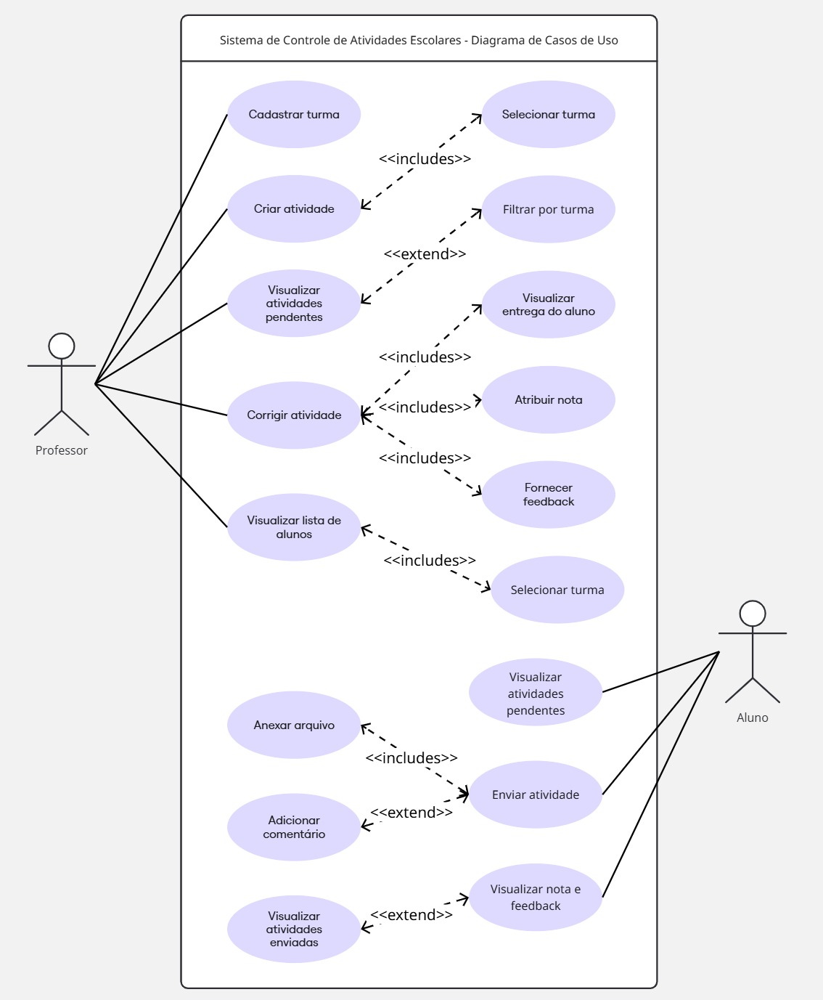
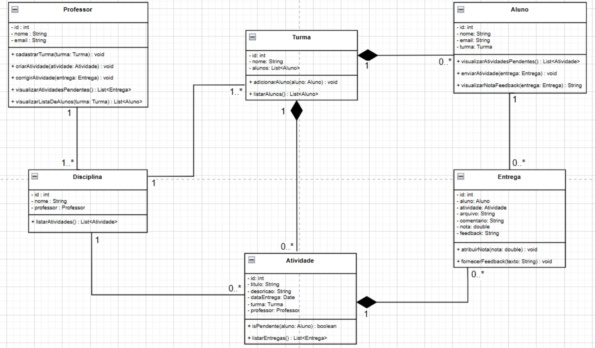

# Sistema de Controle de Atividades Escolares

## Descrição do Cenário
Dan é professor de Geografia e leciona para quatro turmas. Para facilitar a organização das atividades escolares e o acompanhamento das entregas dos alunos, ele está desenvolvendo um sistema web simples. O sistema permitirá criar e publicar atividades por turma, receber as entregas dos alunos de forma digital, corrigir os arquivos enviados e dar notas e feedbacks individualmente.
Como o sistema será utilizado apenas por ele, não será necessário cadastrar usuários múltiplos nem gerenciar várias disciplinas. Tudo será focado exclusivamente no controle das atividades de Geografia para suas quatro turmas fixas.

 

### Requisitos do Professor
- Cadastrar turmas (quatro turmas fixas)
- Criar atividade associada a uma turma.
- Corrigir atividade enviada por aluno.
- Atribuir nota e fornecer feedback.
- Visualizar um painel com as atividades pendentes de correção por turma.
- Visualizar a lista de alunos por turma.

### Requisitos do Aluno
- Visualizar as atividades pendentes de sua turma.
- Enviar a atividade (anexar arquivo e comentário, se desejar).
- Visualizar a nota e o feedback atribuídos pelo professor após a correção.

 

## Diagrama de Casos de Uso

 

## Diagrama de Classes

